# BÁO CÁO BÀI TẬP / ĐỒ ÁN

## THÔNG TIN SINH VIÊN
- **Họ và tên:** Phạm Xuân Tiến
- **Mã số sinh viên:** 24810320273
- **Lớp:** D19QTANM1
- **Tên môn học:** Lập trình C# / Windows Forms
- **Tên bài tập:** Ôn tập 5 Bài Lập trình Windows Forms Thực hành

---

## KẾT QUẢ THỰC HÀNH

### BÀI 1: MÁY TÍNH TÍNH CƯỚC DỊCH VỤ & GIẢM GIÁ
1. **Giao diện chính:**
   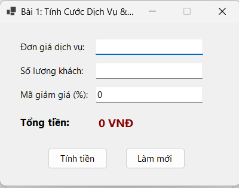
2. **Thực thi chức năng / Kết quả:**
   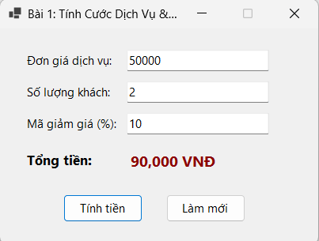
3. **Kiểm tra lỗi (Validation):**
   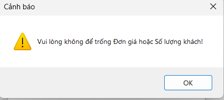

---

### BÀI 2: TIẾP NHẬN & PHÂN LOẠI SỰ CỐ IT
1. **Giao diện chính:**
   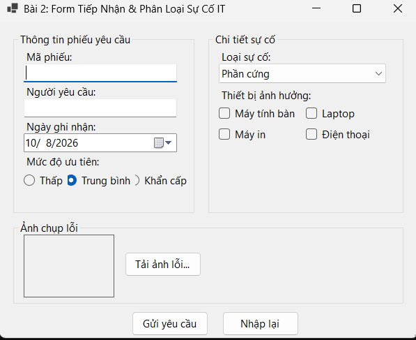
2. **Thực thi chức năng / Kết quả:**
   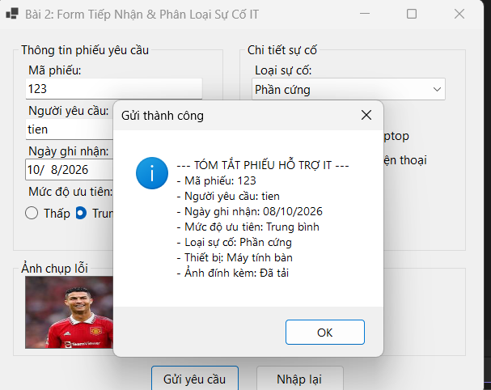
3. **Kiểm tra lỗi (Validation):**
   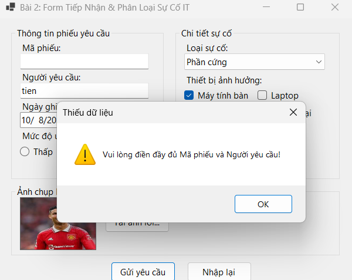

---

### BÀI 3: QUẢN LÝ DANH MỤC VẬT TƯ / LINH KIỆN
1. **Giao diện chính:**
   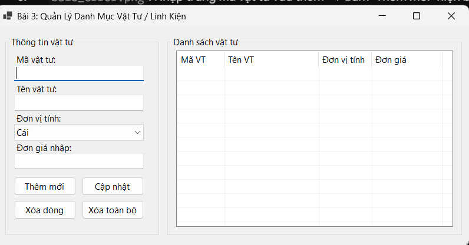
2. **Thực thi chức năng / Kết quả:**
   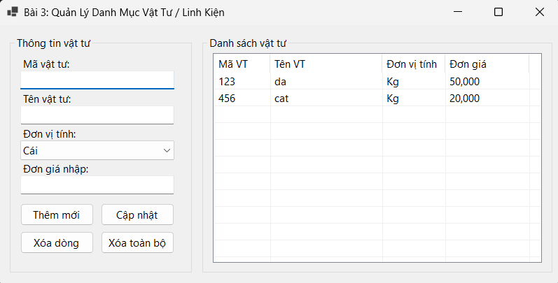
3. **Kiểm tra lỗi (Validation):**
   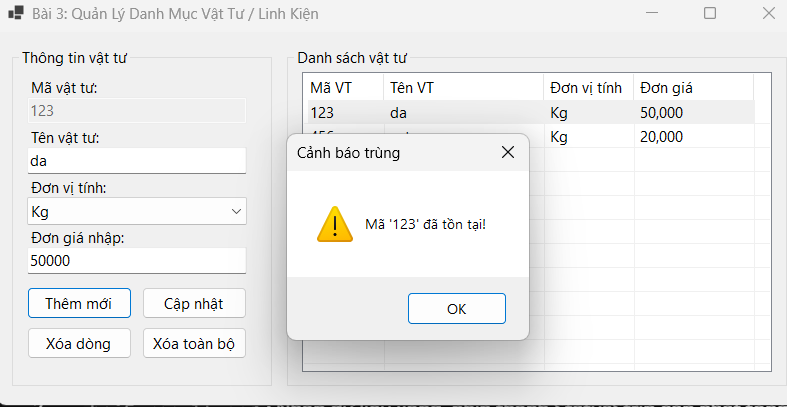

---

### BÀI 4: SƠ ĐỒ CHỌN VỊ TRÍ CHỖ NGỒI / ĐẶT BÀN
1. **Giao diện chính:**
   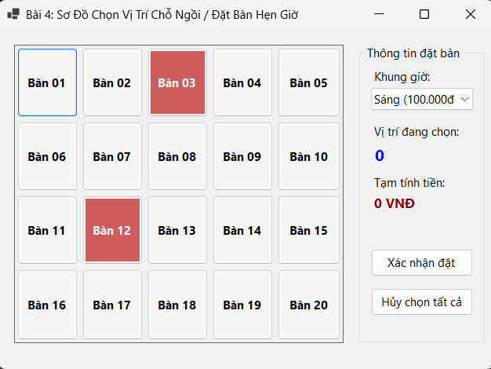
2. **Thực thi chức năng / Kết quả:**
   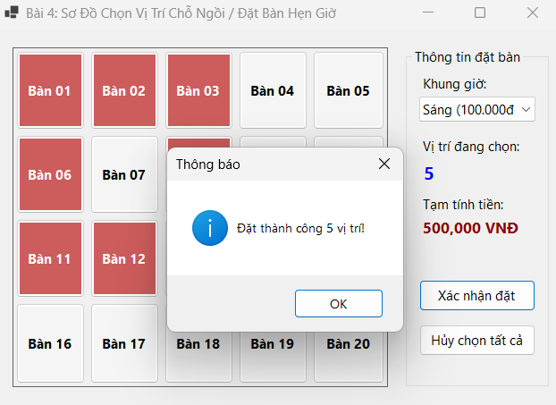
3. **Kiểm tra lỗi (Validation):**
   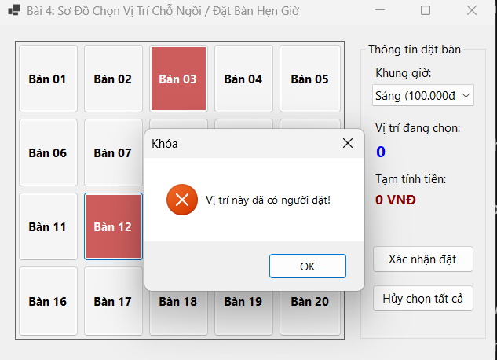

---

### BÀI 5: QUẢN LÝ ĐƠN GIAO HÀNG (DASHBOARD)
1. **Giao diện chính:**
   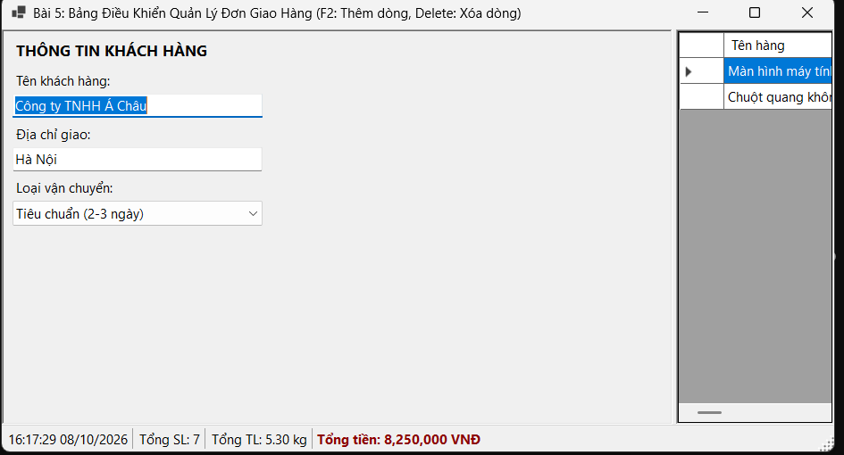
2. **Thực thi chức năng / Kết quả:**
   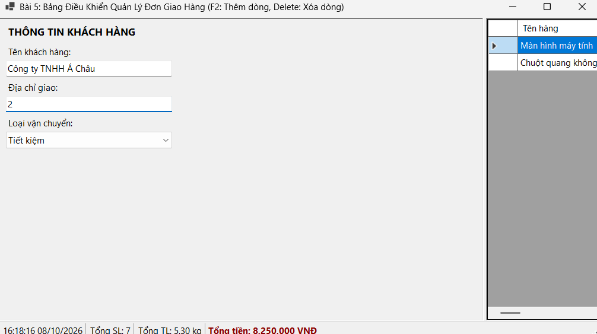
3. **Kiểm tra lỗi (Validation):**
   
